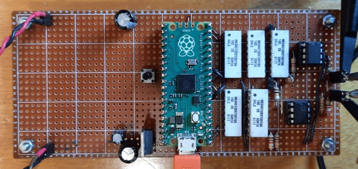
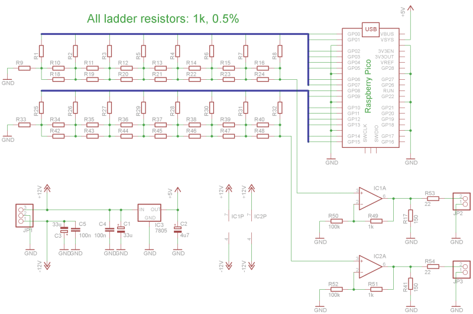

# uWFG-Pico
Inspired by a description of an [Arbitrary Waveform Generator](https://www.instructables.com/Arbitrary-Wave-Generator-With-the-Raspberry-Pi-Pic/) I decided to try something similar myself. The [uSDR-Pico](https://github.com/ArjanteMarvelde/uSDR-pico) project focused on getting to know the Pico, especially the multi-core feature, this project will focus on using PIO and DMA. 

 

The prototype provides two channels with 8 bit resolution, on which waveforms (sample files) can be played independently. The maximum sample frequency is the system clock, so on a Pico this is by default 125MHz. This obviously sets a limit to the maximum waveform frequency, in the sense that it will be a tradeoff with desired accuracy. If a sample file defining a single waveform has a length of 25 samples, the maximum *waveform frequency* is 125/25 = 5MHz. Of course, the real frequence can be increased by including multiple waves in a waveform buffer. There is a practical minimum buffer size of about 8x32bit words, which is driven by the DMA bus conflicts occurring at the highest sample clock rates. The sample clock can also be lowered, so for a minimum frequency both buffer length and clock divider must be tuned.

Still, the performance is quite remarkable, and mostly limited by the implementation of the R-2R ladder network on the digital output. Stray capacitance together with the used resistor values and maybe some inductance will act as a low-pass filter, in case of the prototype maxing output to about 10MHz. 

  

Above image shows 1MHz square waves on both output channels. It must be noted that the R value in the ladder networks is 0.5k in channel A and 1k in channel B, nicely showing the low-pass effect. 
## Prototype circuit
 
 
 
The OpAmp used in this circuit must be a high-speed type, so it does not interfere too much with the waveform. I have used the AD811, which is really a video driver and it goes up to more than 100MHz. The non-inverting case is used here to maximize the input impedance. A slight disadvantage is that it needs to to be supplied with more than +/-5V, in order to fit the whole output range. 
 
 
# Copyright notice
**The code and electronic designs as well as the implementations presented in this repository can be copied and modified freely, for non-commercial use.
Use for commercial purposes is allowed as well, as long as a reference to this repository is included in the product.**

